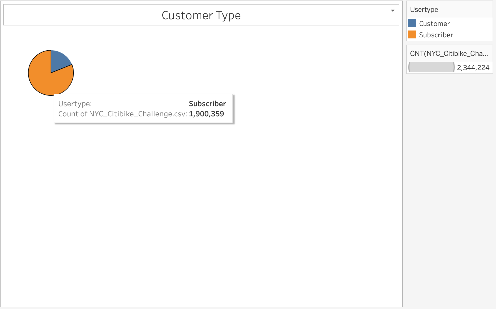
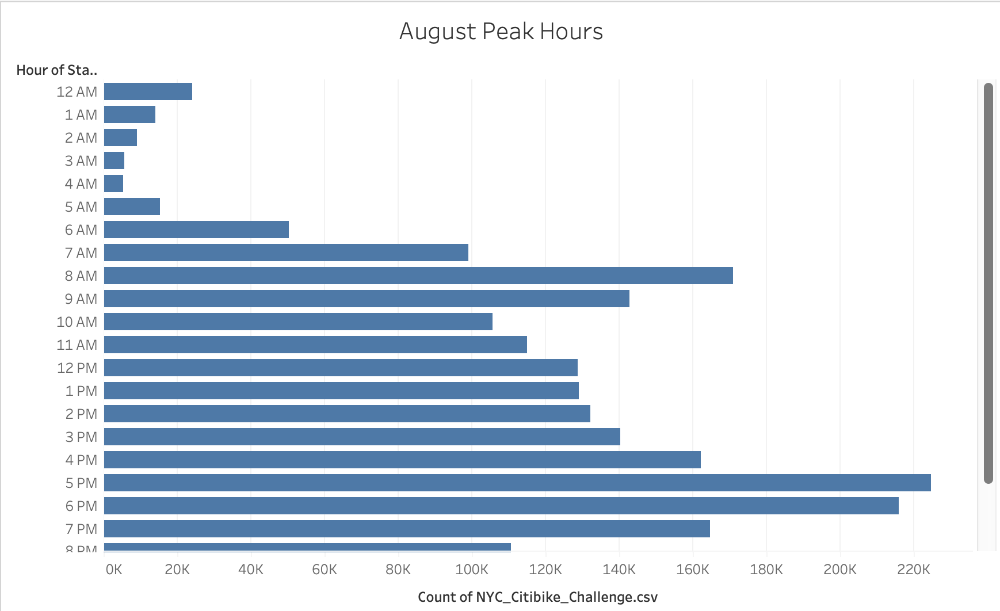
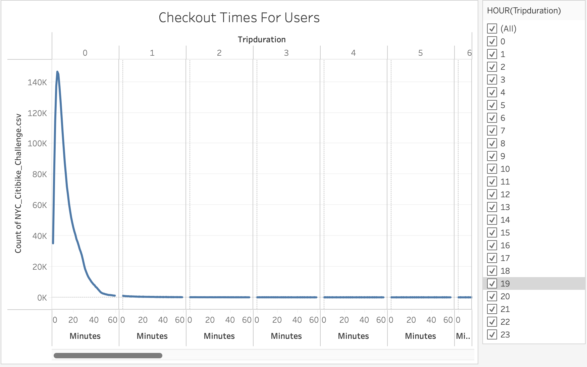
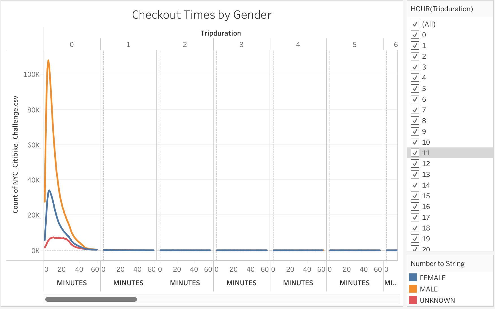
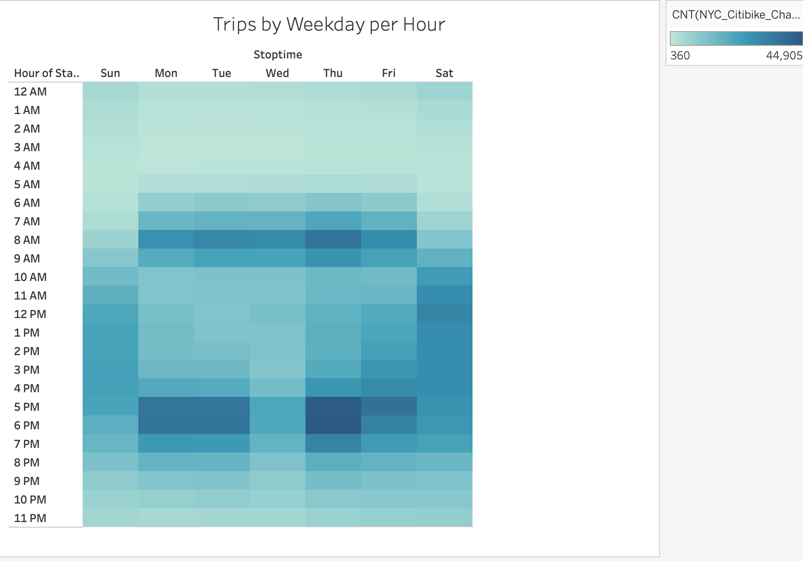
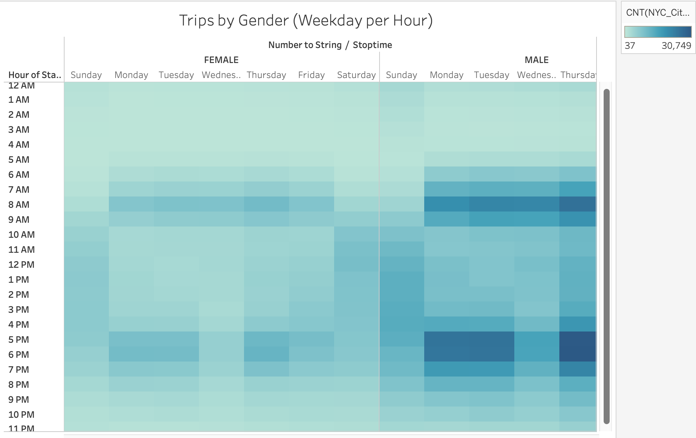

# Bikesharing

## Overview

The purpose of this analysis is to determine the feasibility of implementing a bike sharing program in Des Moines, Iowa by conducting an analysis using Tableau. 

## Results

Tableau was used to create 7 visualizations to help analyze the Citibike data. 

### Customer Type
                        
#### Our First Visualization Focused on the types of users Using Citibike's Bike-Sharing Program. By Creating a Pie Chart we were able to easily see that the vast majority of users were ``Subscribers`` (1,900,359) rather than ``Customers`` (443,865). 

### August Peak Hours

#### August peak hours aimed to determine what times of the day featured Peak Ridership. Through the creation of a horizontal bar chart, we found that Citibike usage was highest between 8 AM - 9 AM and 5 PM - 7 PM. Overall, the chart showed the usage was generally high throughout the day, with the only exception remaining its first four hours. 

### Checkout Times For Users

#### Our Third Visualization, a line chart, looked at how long a customer used a bike to reach their destination. It found that the average ``Trip Duration`` was only 5 minutes long, with steady declines in usage rates afterwards. Users whose trips lasted over 60 minutes were essentially nonexistent.

### Checkout Times By Gender

#### Checkout times by gender looks to analyze if trip duration was in any way dependent on gender. However, we found that gender did not play a role in ``Trip Duration`` as ``Male`` users' trips peaked at 5 minutes, while ``Female`` users' trips peaked at 6 minutes. 

### Trips By Weekday Per Hour

#### Another area of interest was what role the time of day and weekday played in rider usage. As a result, we created a heatmap which showed that the heaviest usage of Citibikes during Weekdays (Monday-Thursday) occurred around 8 AM and 5-6PM. It can be assumed that this is due to riders commuting to and from work. While on the weekends, (Friday-Sunday) there was a wider range of usage starting later in the day, This may be due to riders not having to wake up as early to get to work, and the added free time the weekend affords most users. 

### Trips By Gender (Weekday Per Hour)

####  Trips by gender looks at whether gender played a role in the aformentioned usage patterns. Ultimately we found that the high usage times remained consistent across both ``Male`` and ``Female`` riders. While, ``Unknown`` gender types did not necessarily follow these patterns, this could be attributed to its significantly lower sample size. 

### User Trips By Gender By Weekday

#### User trips by gender shows a. heatmap that looked at both ``Gender`` and ``Weekday`` usage within the context of User Type. This heatmap found that both ``Male`` and ``Female`` Users used the bike-sharing program significantly more if they were a ``Subscriber`` rather than a ``Customer``. Again, the ``Unknown`` gender type did not necessarily follow this pattern, but this again could be attributed to its lower sample size. 

![tripsbygenderbyweekday.png];(Pictures/tripsbygenderbyweekday.png)

### Tableau Story

#### For future reference, this analysis is also listed in my Tableau ``Story`` found on my Tableau Public Dashboard. The Link to My Tableau Public Dashboard can be found [here.](https://public.tableau.com/app/profile/mandy.jimenez/viz/NYCCitibikes_16536982758940/Story1?publish=yes)

## Summary

### Analysis

#### Looking at our Tableau Visualizations we can infer the following conclusions: 

* Men Tend to Use Citibike Bike-Sharing Programs signifcantly More Than Women.
* During weekdays, ridership is highest during commuting hours.
* During the weekend, ridership is spread out amongst the middle of the day and ridership begins to spike later. 
* Gender doesn't play a significant role in ridership.
* Trip durations peak at 5 minutes and then decline as the minute passes suggesting that most users use the program for short distances. 
* The majority of users are subscribers.
* Subscribers are more likely to use bike-sharing during peak periods. 

### Additional Visualizations

#### While this is a good start for our analysis, there are additional visualizations we can create to further our understanding; a couple of potential charts can be found listed below. 

* A Line Chart showing checkout times throughout the entire year to analyze how ridership varies throughout different seasons.
* A Pie Chart showing the proportion of user ages to analyze the average age of a given region's household. 